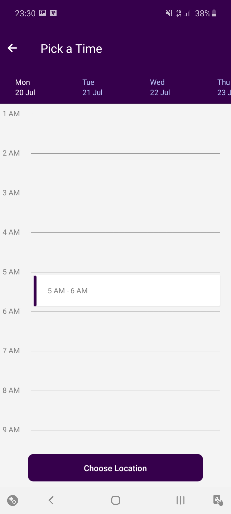

# Test project
  Built with React Native.

## Requirements
* [`npm`](https://www.npmjs.com/get-npm)
* [`react-native`](https://reactnative.dev/)

## Usage for development
1. Open your terminal or command prompt
2. Type `git clone https://github.com/Vikraardiansyah/testProject.git`
3. Open the folder and type `npm install`
4. Type `react-native run-android` for run this app. ***Make sure your device is connected with debugging mode***.

## Screenshots

    
    
    

## Release APK
[`testProject`](https://drive.google.com/file/d/1DSJDtmyT3qEfLI40aIfz_QNrBA99iYeR/view?usp=sharing)

## Contributors
[`Vikra Ardiansyah Zaini`](https://github.com/Vikraardiansyah)
